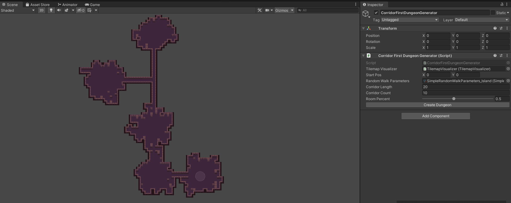

# Dungeon Level Generator

Random Dungeon and Level Generator for 2D games

## Features
  
* Level Generator
  - simple level generator using prefabs rooms and randomize directions

* Dungeon Generator
  - procedual dungeon generator
  - randomize floors, corridors, rooms
  - use Boundint to create splited rooms
  - auto genate walls around the rooms

## ScreenShots
&nbsp;&nbsp;&nbsp;&nbsp;

&nbsp;&nbsp;&nbsp;&nbsp;

